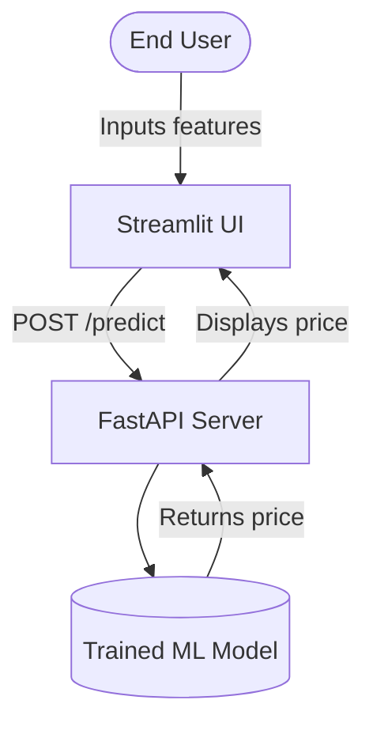

# Architecture and MLOps Flow

This document visually explains the fundamental architecture and lifecycle of our House Price Prediction system.

## Overall System Architecture

## MLOps Pipeline Workflow (Orchestrated by n8n)

```mermaid
flowchart LR
    A[Data Generation] --> B[Data Versioning \n DVC / Git]
    B --> C[Model Training \n Scikit-Learn]
    C --> D[Experiment Tracking \n MLflow]
    D --> E[Model Registry \n MLflow]
    E --> F[API Deployment \n FastAPI]
    F --> G[Monitoring / UI \n Streamlit]

    style A fill:#f9f,stroke:#333,stroke-width:2px
    style B fill:#bbf,stroke:#333,stroke-width:2px
    style C fill:#bfb,stroke:#333,stroke-width:2px
    style D fill:#fbb,stroke:#333,stroke-width:2px
    style E fill:#fbf,stroke:#333,stroke-width:2px
    style F fill:#bff,stroke:#333,stroke-width:2px
    style G fill:#ffb,stroke:#333,stroke-width:2px
```

## Directory Structure
- `data/`: Contains datasets versioned by DVC.
- `src/`: Core logic for data generation and training.
- `api/`: Scripts necessary to serve the model as a backend.
- `app/`: Frontend Streamlit source code.
- `n8n/`: Orchestration files.
- `docs/`: Theory and Presentation documentation.
